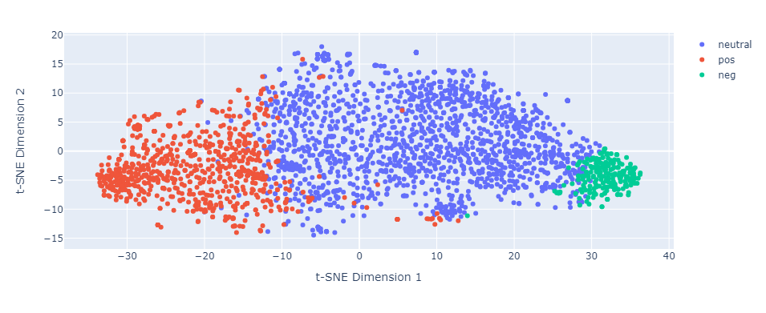
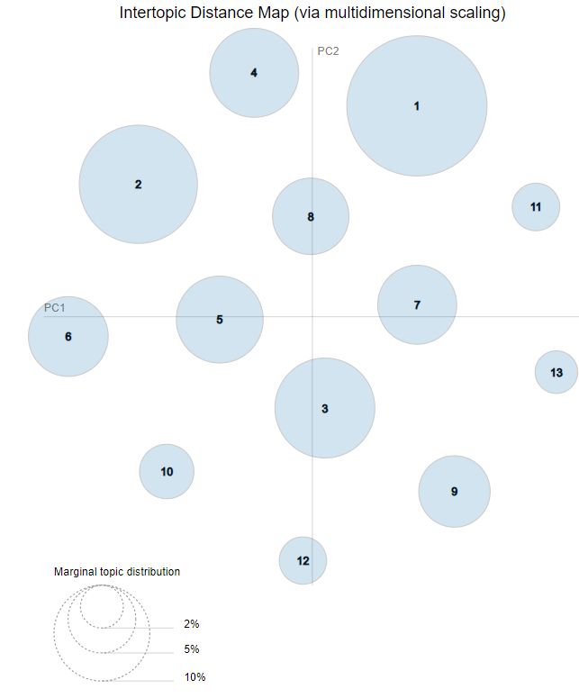
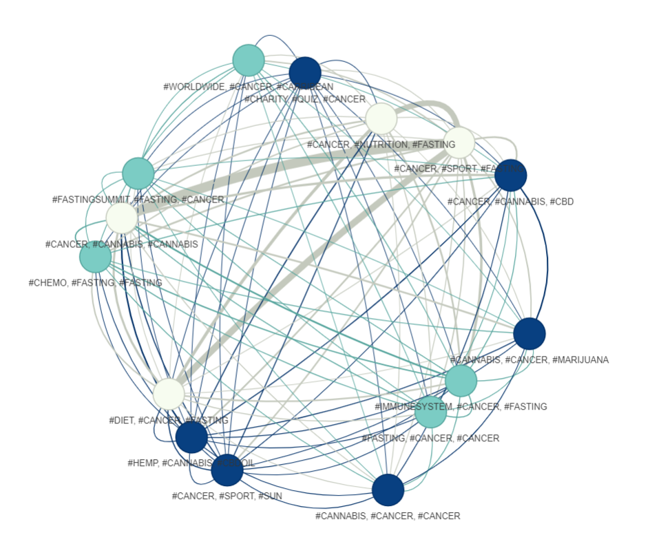

# INM-Explain - Explaining Medical Controversies: Application to the Case of Non-Pharmacological Interventions

## Project Description

This project led to the creation of an article titled *"INM-Explain - Explaining Medical Controversies: A Case Study on Non-Pharmacological Interventions"*, which was presented at the **PFIA 2024 conference** in La Rochelle, France 🇫🇷. 

**Problem Statement**: How can data visualizations help us better understand the factors driving controversy on Twitter? And how can these factors be used to improve tweet classification through semantic analysis of sentence structures?

**Themes Studied**: Health (COVID-19, Non-Pharmacological Interventions) 🏥

This project delves into the controversies that emerge on Twitter around health-related topics, specifically non-pharmacological interventions (INM) used in cancer treatment. Through advanced techniques in textual data analysis, deep learning, and semantic modeling, we explored public reactions and their polarities toward these controversial topics.

## Objectives and Methodology

### 1. **Data Collection and Preprocessing**  
- **Data Used**: Over 50,000 tweets collected in 2020 from key hashtags such as #sport, #cancer, #fasting, #cannabis. These tweets were filtered and cleaned to eliminate duplicates and ensure the relevance of the analysis.

### 2. **Tweet Analysis and Visualization**  
- **Bubble Chart**: Visualizing the most popular hashtags and the interactions they generate on Twitter 📊💬.  
- **Sentiment and Emotion Visualization**:
  - Using the **RoBERTa pre-trained model from Hugging Face** for sentiment analysis on tweets. This model, based on BERT, classifies tweets into positive, negative, or neutral sentiments 🌈🧠.
  - **t-SNE (t-Distributed Stochastic Neighbor Embedding)**: A dimensionality reduction technique to visualize sentiment clusters (positive, negative, neutral) and their relationships 🌍💥.

  

    
### 3. **Topic Modeling**  
- **Latent Dirichlet Allocation (LDA)**: This model identified the dominant topics in the tweets, highlighting subjects like the medical benefits of cannabis and exercise in cancer treatment 🌱🏃‍♀️.

  

- **Clustering**: We applied **KMeans** and **Force Atlas** algorithms to group Twitter communities based on shared hashtags, visualizing the connections between different discussions on controversial topics 🤝🔗.

  

### 4. **Controversy Index**  
- A **controversy index** was created by considering factors like retweets, likes, and sentiment polarity. This score quantifies the intensity of controversy around certain tweets and hashtags, identifying the most polarizing discussions 🔥💬.

## Key Results

- **Polarization of Opinions**: Sentiment analysis revealed significant polarization on topics like medical cannabis use. Distinct pro and anti groups emerged, fueling heated debates 🔴🟢.
- **Dominant Topics**: LDA analysis uncovered key topics such as *"Health Benefits of Cannabis"* and *"Using Fasting in Cancer Treatment"*, showing the growing importance of these discussions 🌿🍽️.
- **Divergent Communities**: Clustering techniques allowed us to visualize how Twitter users group around specific topics (e.g., medical cannabis and fasting), with clearly defined discussion groups 🧑‍🤝‍🧑💬.

## Technologies and Tools Used

- **Deep Learning and NLP**:
  - **RoBERTa Pre-Trained Model (Hugging Face)**: Used for tweet sentiment analysis, classifying tweets as positive, neutral, or negative 💻🤖.
  - **t-SNE**: For dimensionality reduction and visualizing sentiment clusters in 2D 🌍📉.
  
- **Topic Modeling and Clustering**:
  - **Latent Dirichlet Allocation (LDA)**: For topic modeling to identify the main themes in the tweets 🧠📚.
  - **KMeans and Force Atlas**: For clustering and visualizing communities of Twitter users based on hashtags 🌐🔄.
  
- **Controversy Analysis**:
  - **Controversy Index**: Calculated by considering the number of likes, retweets, and sentiment polarity in the tweets, allowing us to quantify the level of controversy 🔥🔥.

- **Data Visualization**:
  - **Streamlit and Plotly**: For creating interactive data visualizations 📊📈.
  - **Pyvis**: For generating interactive graphs of hashtag relationships and communities 🔗🔍.

## Conclusion

This project demonstrated that data visualizations and advanced techniques like NLP and deep learning are powerful tools for exploring and understanding medical controversies on social media. We successfully highlighted the polarized debates surrounding topics like medical cannabis and non-pharmacological interventions, offering insights into the dynamics of public discourse. The project paves the way for further studies on controversial topics across different platforms and domains 🌐💡.
